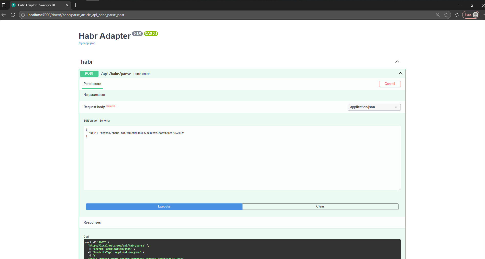

### Обновление (Lab 1)

- добавлены Dockerfile.bad и Dockerfile.good
- запущено приложение в контейнере

### Обновление (Lab 2)
- добавлен `docker-compose.yaml`
- реализована логика сохранения в БД и кэширования
- добавлен `.env` файл