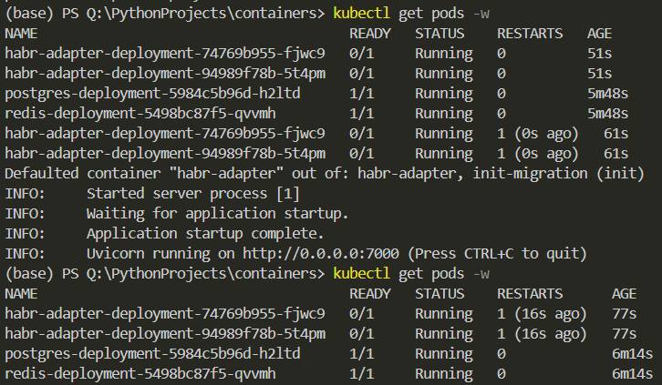
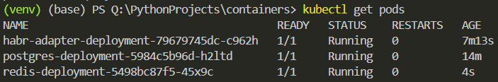
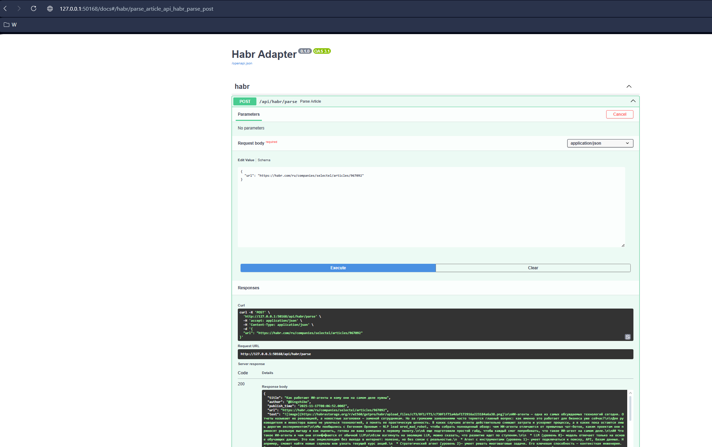
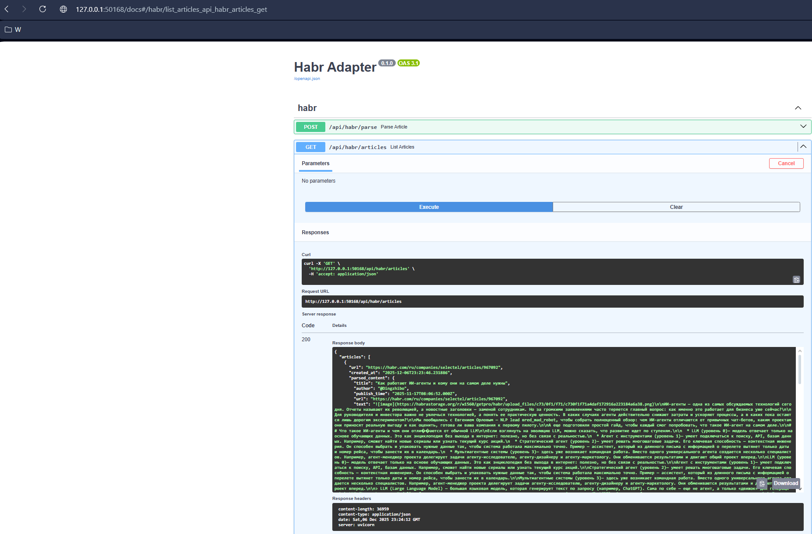

## Ход выполнения

1) Описание конфигов `k8s/habr_project/config.yaml` и `k8s/habr_project/secrets.yaml`
2) Описание манифестов для `postgres`, `redis` и основного приложения
Из тонкостей, образ основного приложения подтягиваем локально, поэтому ставим параметр `imagePullPolicy` как `Never` и собираем образ внутри `minikube`
Также добавляем `PersistentVolume` для `postgres`
```
minikube docker-env | Invoke-Expression
docker build -t habr-adapter-image:latest -f habr_adapter/Dockerfile.good habr_adapter/
```
3) Создание манифестов в кубере
```
kubectl apply -f k8s/habr_project/
```
4) Решение проблемы: основное приложение запускается нормально, но кубер так не считает (причина оказалась в неверно указанном пути в livenessProbe и readinessProbe)





5) Туннелирование основного приложения
```
minikube service habr-adapter-service
```

6) Проверка работы

`основное приложение` + `redis`



---

`основное приложение` + `postgres`

