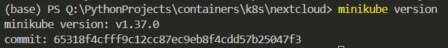

## Ответы на вопросы (Lab 3)
1. Важен ли порядок выполнения манифестов? Почему?
Технически, кубер не запрещает запускать манифесты в любом порядке, но логически если создать Pod до создания ConfigMap или Secret, на которые он ссылается, Pod не запустится и будет висеть в ошибке, пока необходимые ресурсы не появятся

2. Что (и почему) произойдет, если отскейлить 
количество реплик postgres-deployment в 0, затем обратно в 1, 
после чего попробовать снова зайти на Nextcloud?
Все активные поды postgres удалятся и создадутся заново, если мы не использовали Persistent Volumes, то данные потеряются

## Ход выполнения

1) Установка `kubectl` и `minikube`, проверка результатов установки



2) Запуск `minikube`

```
minikube start
```

3) Описание манифестов для `postgres` и `nextcloud` с разбиением на `secret`, `configmap`, `deployment` и `service` в случае `postgres`

4) Создание манифестов в кубере
```
kubectl create -f pg_secret.yaml
kubectl create -f pg_configmap.yaml
kubectl create -f pg_deployment.yaml
kubectl create -f pg_service.yaml
kubectl create -f nc_secret.yaml
kubectl create -f nc_configmap.yaml
kubectl create -f nc_deployment.yaml
```

5) Отслеживание статусов запуска
```
kubectl get pods -w
```


6) Создание объекта типа `service` для `nextcloud` для последеющего туннелирования трафика localhost
```
kubectl expose deployment nextcloud --type=NodePort --port=80
```

7) Непосредственно туннелирование
```
minikube service nextcloud
```


8) Проверка работы

